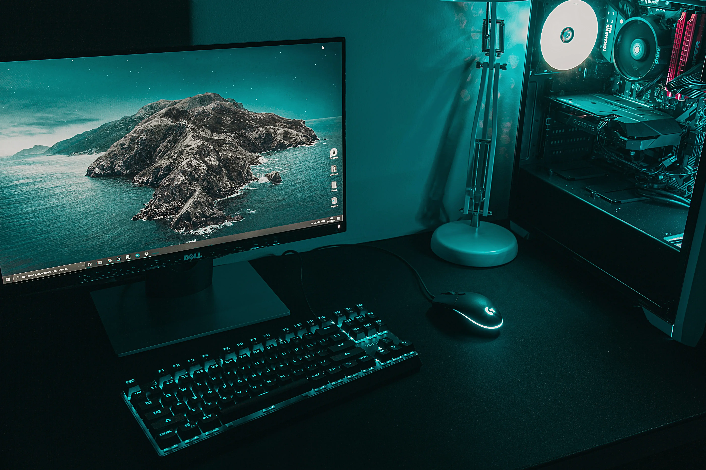

  <h1 align="center">
  Hello!  My name is melau-eddy 
</h1>

  

A 20 year old aspiring Backend developer and an AI Enthusiast with an experience of 2+ years from Nairobi Kenya.

My story began with a simple curiosity: **"How does the internet work?"** 🌍  
What started as countless hours of breaking websites and fixing them again turned into a deep passion for **building scalable applications** and **intelligent systems** that solve real-world problems.

From my first "Hello World" in HTML to deploying full-stack apps in the cloud ☁️, every project, bug, and breakthrough has shaped me into the developer I am today.  
Along the way, I discovered the transformative power of **Artificial Intelligence** — and it opened an entirely new world of possibilities. 🤖✨

Today, I specialize in crafting **beautiful front-ends**, **robust back-ends**, and **intelligent solutions** with machine learning models.  
Whether it's designing seamless user experiences, optimizing databases, or training neural networks, I believe that **technology should empower people**.

  ### 🔥 What Drives Me

- 💡 The thrill of solving complex problems.
- 🚀 The excitement of seeing an idea come to life.
- 🤝 The joy of collaborating and learning from the developer community.
- 🌱 The belief that growth never stops — every day is a new chance to become better.

---

**Let's build the future together! 🚀**

---

## 🛠️ Skills & Tech Stack

| Skills                      | Tech Stack                                                                                                           | Info                                                       |
|------------------------------|----------------------------------------------------------------------------------------------------------------------|------------------------------------------------------------|
| **Main**                     |  &nbsp;&nbsp;  | Dart, Python                                               |
| **Front-end**                |  &nbsp;&nbsp;  &nbsp;&nbsp;  &nbsp;&nbsp;  &nbsp;&nbsp;  &nbsp;&nbsp;  | Bootstrap, HTML, CSS, HTMX, JavaScript, Vite, Vue.js       |
| **Back-end**                 |  &nbsp;&nbsp;  &nbsp;&nbsp;  | Django, Django REST, FastAPI, Postman                      |
| **Database**                 |  &nbsp;&nbsp;  &nbsp;&nbsp;  | PostgreSQL, Firebase, SQLite                              |
| **Cloud & Hosting**          |  &nbsp;&nbsp;  &nbsp;&nbsp;  &nbsp;&nbsp;  | AWS, Digital Ocean, Heroku, Render                         |
| **Mobile App Development**   |                                 | Flutter                                                    |
| **Version Control**          |  &nbsp;&nbsp;  | Git, GitHub                                                |
| **Containers, CI & CD**      |  &nbsp;&nbsp;  | Docker, GitHub Actions                                    |
| **Machine Learning**         |  &nbsp;&nbsp;  &nbsp;&nbsp;  &nbsp;&nbsp;  &nbsp;&nbsp;  | Jupyter, NumPy, OpenCV, Pandas, Scikit-learn               |
| **Amateur**                  |  &nbsp;&nbsp;  | C, C++                                                     |

---

## 🛠️ Tools

  
  
  
  
  

---

## 🖥️ Most used programming languages

## 📫 Contact Me

- 📧 Email: [melaueddy@gmail.com](melaueddy@gmail.com)
- 💼 LinkedIn: [melau-eddy](https://www.linkedin.com/in/melau-eddy/)
- 🖥️  See my portfolio at: [Melau-Eddy portfolio](https://myportfoliowebsite-swart.vercel.app/)

---

Thank you for visiting my profile! Feel free to explore my repositories and show some love by hitting the star   
⭐ button on my repositories.

You can reach out if you'd like to collaborate or have any questions.

  

&nbsp;

